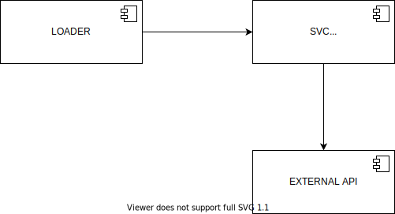
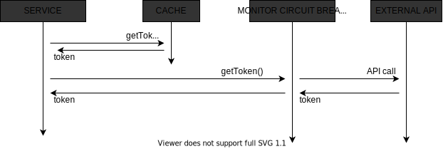

# Propuesta de solución para Hackathon Ceiba 2021

## Descripción de la solución 

Contamos con un microservicio construido en **java** y **spring boot**, cuando se consume el servicio retorna un **token** que obtiene de una **api externa** y con la cual se establece comunicación mediante **HTTP**. Para controlar escenario de fallo en los que la **api externa** no esté disponible, se propone:
	
- **Cache (Propia)**: Se almacenan en caché los registros con clave que corresponde al parámetro recibido por petición, el tiempo de vida de cada registro es dinámico, ya que corresponde al tiempo de vida propio del token.
	
- **Circuit breaker (Hystrix)**: Implementamos patrón **circuit breaker** con un máximo de 4 errores para abrir el circuito y un ventana de espera de 1.5 segundos para reintentar.

## Drivers que orientan la toma de decisiones para la solución propuesta

Disponibilidad:

- El componente  debe estar disponible todo el tiempo posible y responder exitosamente.

Rendimiento:

- Debe atender la mayor cantidad de peticiones en el menor tiempo posible.

## Diagrama de solución 

Diagrama de componentes:

 

Diagrama de secuencia:

 

